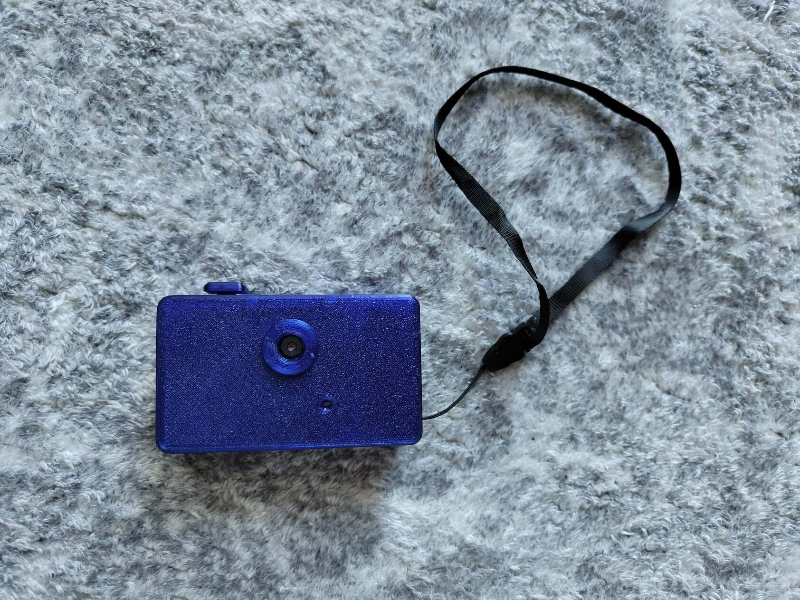
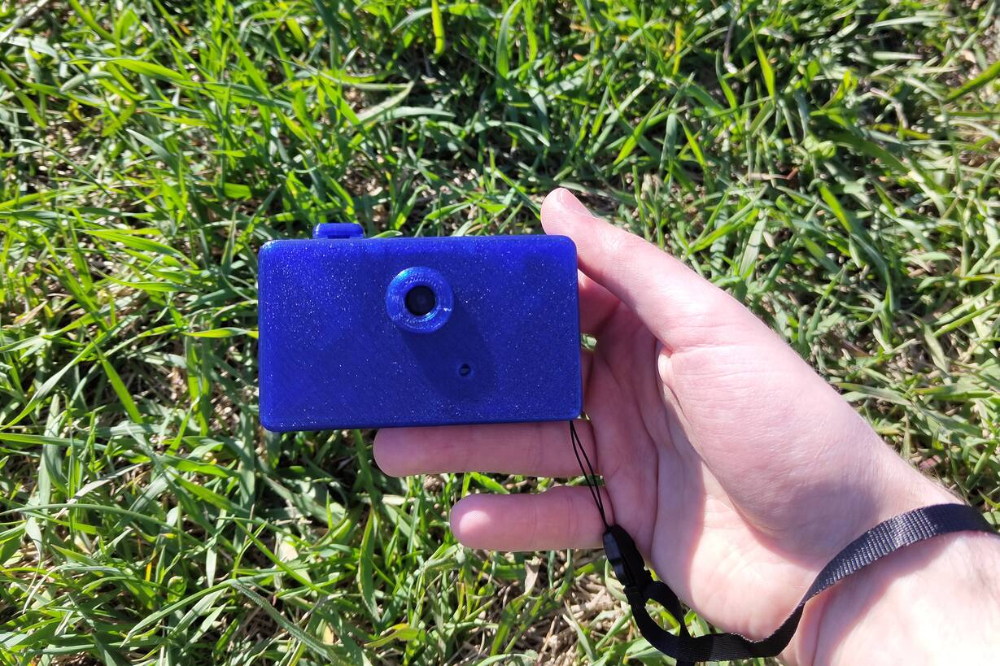
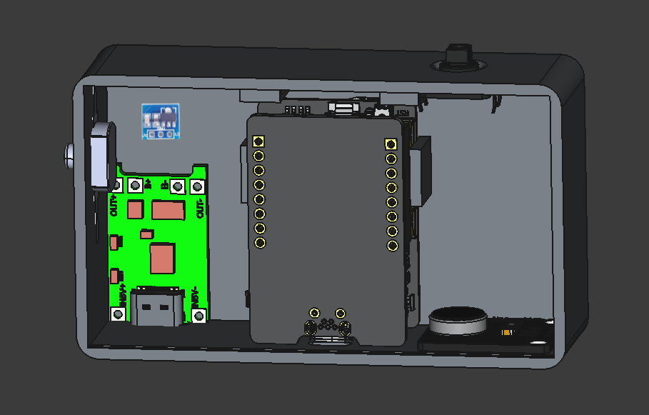
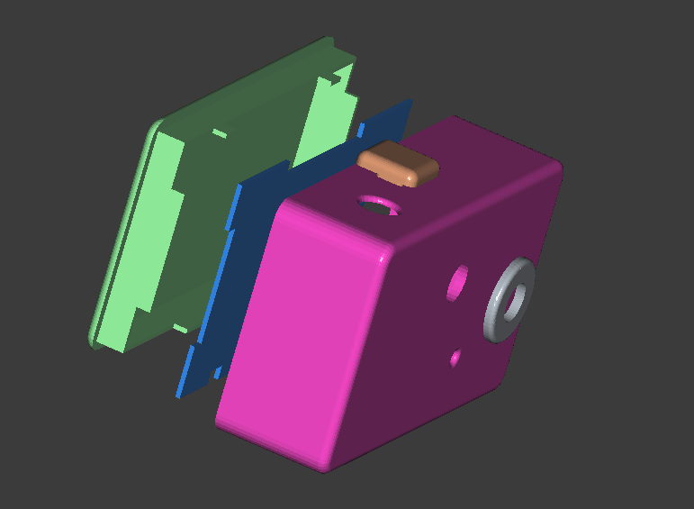
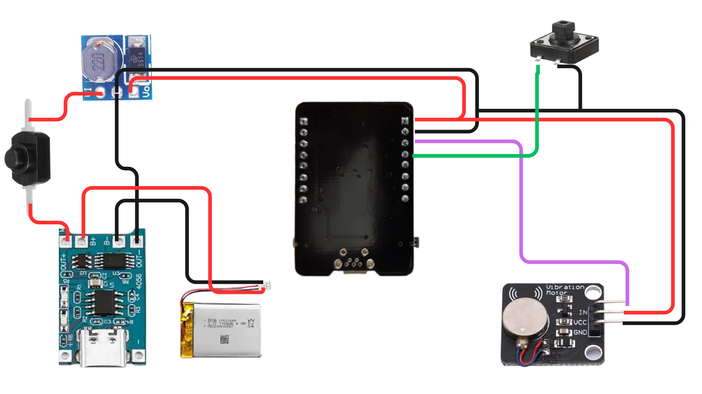
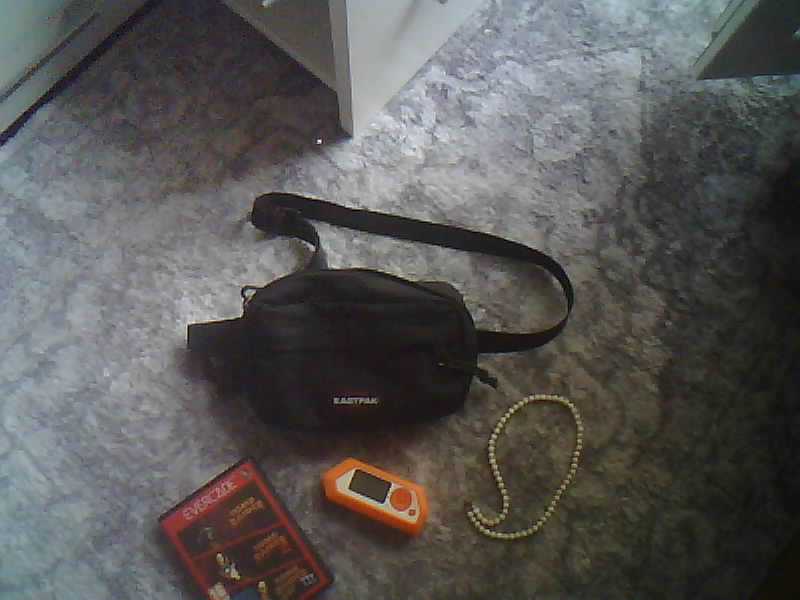
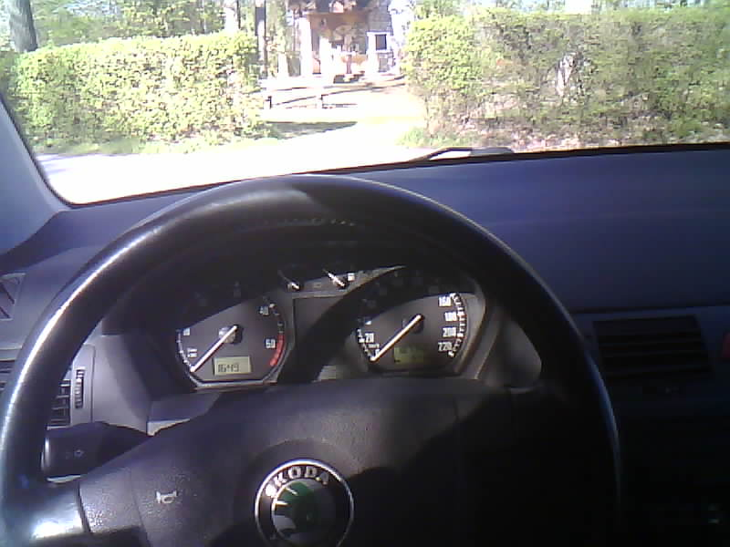

## 📸 Obscura One – An Open-Source Screenless Camera

  
  

A minimalist, fully open-source camera project with a nostalgic 2000s vibe.  
Designed to be simple, hackable, and entirely 3D printable.

📰 Featured article about the project: [Hackster.io](https://www.hackster.io/news/the-obscura-one-is-a-tiny-nostalgia-driven-pocket-camera-you-can-build-for-just-35-843e0a65a846)

☕ Like this project? Support me here: [https://buymeacoffee.com/chriko3](https://buymeacoffee.com/chriko3)

---

## ⚙️ Key Facts

* 🧠 **Difficulty Level:** 3 / 5
* ⏱️ **Build Time:** ~4 hours
* 📸 **Photo only camera**
* 🧩 **Fully Open Source**
* 🖨️ **100% 3D Printable Housing**
* 🔋 **Battery Life:** ~2–3 hours (depending on Wi-Fi usage)
* 💸 **Estimated Cost:** under €30/35$
* 🛒 **Parts Availability:** Amazon

**Short video of the camera in use (handheld demo)**

  <video width="70%" controls>
    <source src="img/cam_video.mp4" type="video/mp4">
  </video>

---

## 🛠️ Built With

* **3D Design:** FreeCAD
* **Firmware:** Arduino
* **AI Assistance for Code and Read me:** Cursor AI & Chat GPT

---

## 🎮 Features

* 🎛️ **Single-button control system**
* 📷 **Photo capture modes:**

  * 1 click → Normal photo
  * 2 clicks → Photo with flash
* 📡 **Wi-Fi mode:**

  * Hold for 3 seconds → Activate Wi-Fi for photo download
  * Hold for 3 seconds (while in Wi-Fi mode) → Deactivate Wi-Fi and return to photo mode
  * **Wifi Name:** Obscura One
  * **Password:** 12345678
* 📳 **Haptic feedback via vibration module**

  * 1 long vibration → Device powered on  
  * 1 short vibration → Normal photo taken  
  * 2 short vibrations → Photo with flash taken  
  * 3 short vibrations → Wi-Fi activated (photo mode deactivated)  
  * 3 long vibrations → Wi-Fi deactivated (photo mode activated)
---

## 🧰 Components

- **AI Thinker ESP32-CAM Module**  
  https://amzn.to/4tbcQNc  

- **Micro SD Card**  
  https://amzn.to/4ckgBJ6  

- **TP4056 USB Charging Module**  
  https://amzn.to/4crliB1  

- **1100 mAh LiPo Battery**  
  https://amzn.to/482OfBQ  

- **Self-Locking Push Button Switch**  
  https://amzn.to/4cqLJ9I  

- **Step-Up (Boost) Converter Module**  
  https://amzn.to/4sCSewi

- **PWM Vibration Motor Module**  
  https://amzn.to/48P5irh  

- **Tactile Button (Momentary Switch)**  
  https://amzn.to/4tdiw9J  

- **Optional**
  - Hand Strap
  https://amzn.to/4emuPM7
  - PETG i used
  https://amzn.to/4vvWlwI
 
*Note: These are affiliate links.*

---

## 🖨️ 3D Printing

All structural parts are designed to be fully 3D printable.

**Recommended settings:**

* Material: PETG
* Layer height: 0.15–0.2 mm
* Infill: ~20%
* Supports: Required for case and back cover

* 3D model on Printables: [https://www.printables.com/model/1662215-obscura-one](https://www.printables.com/model/1662215-obscura-one)

---

## 🔌 Assembly

1. Print all required parts
2. Format SD Card to FAT32 and insert it
3. Assemble the electronics according to the wiring diagram
4. Insert all modules into the housing
5. Secure the button, vibration motor, charging module, and step-up module using hot glue
6. Close the case using super glue
7. Flash the firmware

  
    

---

## 📝 Arduino Setup

1. Open Arduino IDE and add the ESP32 board manager URL:
   `https://raw.githubusercontent.com/espressif/arduino-esp32/gh-pages/package_esp32_index.json`
2. Go to **Tools → Board → Board Manager**, search for **ESP32** and install it.
3. Select **AI Thinker ESP32-CAM** as the board.
4. Install any missing libraries via Arduino Library Manager (Sketch → Include Library → Manage Libraries).

---

## 🔌 Circuit

**Pin Mapping:**

* TC4056 OUT+ → Mini Push Button Switch → Step-Up VIN
* TC4056 OUT− → Step-Up GND
* Battery + → TC4056 B+
* Battery − → TC4056 B−
* Step-Up VOUT → 5V ESP32-CAM Module
* Step-Up GND → ESP32-CAM GND
* Tactile Button → ESP32 GND
* Tactile Button → GPIO 13
* PWM Vibration Motor Module IN → GPIO 12
* PWM Vibration Motor Module VCC → 5V ESP32
* PWM Vibration Motor Module GND → ESP32 GND

**Wiring Diagram:**

  

---

## 🖼️ Example Photos

Here are some sample shots taken with Obscura One:

  
  
  
  
  
  

---
## 📜 License

Obscura One is released under the MIT License.  
You may use, modify, and distribute this project freely.  
**If you publish or redistribute it, please credit the original author by name.**

---

## ⚠️ Liability

This project is provided as-is, with no guarantees of any kind.

By building, modifying, or using this device, you do so entirely at your own risk.
I take **no responsibility whatsoever** for any damage or issues that may occur, including:

* Hardware damage
* Data loss
* Personal injury
* Any direct or indirect consequences

There is no warranty for functionality, safety, or fitness for any purpose.

**In short: I am not liable for anything.**
